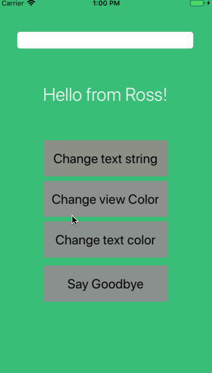

## MAD DEMO

### App Description
We've had moments where communication is annoyingly difficult. You type words down and people complain that the text is <i>too small</i>. You make the words bigger, but someone else complains that they can only comprehend orange text on a green background. You give them what they want and yet still recieve complaints about your iphone screen being too dirty. Thus, leading you to search for an easy way to tell them "bye". This app can do all of the above and more.

### App Walk-though
<b>Change Text String</b> - Type into the text bar above your prompt. Then tap the "change text string" button to change the text on the screen. 
<b>Change View Color</b> - Tap this button to change the background color to red, making your text easier to read. 
<b>Change Text Color</b> - Tap this button to change the text color to orange. Warning: never mix this with the button stated above. 
<b>Say GoodBye</b> - Tap this button to tell the consumers who are not satisfied by a developers hard work goodbye. 
<b>Secret Tip!</b> - Tap the background and it resets all objects to thier original format. 
          

 

### Required User Stories
- [x] 1. User sees custom text in a label - Hello from {name}!
- [x] 2. User see's custom background color.
- [x] 3. User can tap a button to change the text color of the label.

### Optional User Stories
- [x] 1. User can tap a button to change the color of the background view.
- [x] 2. User can tap a button to change the text string of the label - Goodbye 👋.
- [x] 3. User can tap on the background view to reset all views to default settings.
- [x] 4. User can update the label text with custom text entered into the text field.
   - [x] a. User can enter text into a text field using the keyboard.
   - [x] b. User can tap the "Change text string" button to update the label with the text from the text field.
   - [x] c. If the text field is empty, update label with default text string.
   - [x] d. The keyboard is dismissed after the button has been tapped.
